# Documentation for creating a basic VM (Virtual Machine) on Azure


## PLANNING

The following should be considered when making a VM deployment:

- **ssh key pair**: needs to be generated to allow for remote access to the VM from your local command line interface or terminal
- **name**: what will the VM be called? It should follow some kind of naming convention so that it can easily be searched and found
- **location and pricing**: where will the VM be created, geographically? It should be close to the users it will serve, to reduce latency. Depending on the usage of the VM, it will need certain specifications, and this will affect the running costs of it.
- **availability**: what will be the required uptime for the VM, or (more likely) for the service the VM will provide?
- **costs**: different regions will have different pricing, and different VM specifications (CPU, RAM, Storage, etc) will be priced differently
- **compliance**: the VM should be located appropriately to comply with local laws. For example, data created or pertaining to UK customers or users will need to comply with the UK GDPR laws. 
- **size**: the size of the VM (specifications) need to be considered, appropriate for its use. A VM serving a high demand audience or use case will need large specifications.
- **storage**: will the VM need a lot of storage for data, or for installed applications? Or will it use external storage, and merely manipulate data as throughput by the CPU?
- **OS**: what Operating System will the VM run? What version of the OS? Do you need to make a custom image as a template for further VMs? (A custom image is an instance of a VM as a file, that can be deployed multiple times, that only has the minimum appropriate features for getting the task(s) done. It should have no individual information or data residing on it.)
- **VNET**: the virtual network ("vnet") will be the overriding infrastructure that will contain your VMs (within it, there will be various Public- and Private-subnets that will allow different access to ingress and egress traffic).


## WHAT IS SSH?

SSH was referred to above as one of the primary planning stages. SSH stands for Secure SHell: a shell is a command-line interface that allows you to interact with your computer. You give it commands in a language it understands, and it translates those commands into actions that the OS can perform. Common shells include: BASH, ZSH, PowerSHell, etc. 

So, when you ssh into a machine or VM, you are essentially creating a secure communication portal in which to interact with the machine or VM. 

In order to perform the ssh session, you need to generate a Private-Public key pair, using the following code:

```
ssh-keygen -t rsa -b 4096
```
This code should be run in the hidden directory ".ssh" within your home user folder. To do that:
```
$ cd ~
# Takes you to your home folder

$ mkdir ./.ssh
# Makes the directory .ssh in the current directory, i.e. your home folder

$ ssh-keygen -t rsa -b 4096
# This generates the RSA encryption key pair, which you should give an appropriate name, e.g. "cloudfun1-<your_name>-az-key. 
```
Two keys will be created at this point:

- **cloudfun1-<your_name>-az-key**: this is the private key. It should never be shared or exposed to other users. It should never be put on a Github repository, or included in documentation.
- **cloudfun1-<your_name>-az-key.pub**: the public key that will be inserted on the VM or VM custom image, to allow you to ssh into that machine or VMs. 


## CONFIGURING A VM INSTANCE ON AZURE:

1. log into the Azure portal at:
   ```
   https://portal.azure.com/#home
   ```
2. click Virtual Machines, or perform a Search for it in the menu bar:
   
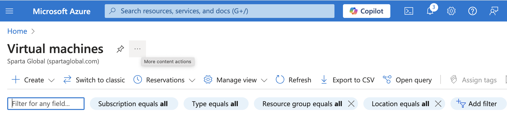

2. Click "Create" on the next page > Click "Azure virtual machine".

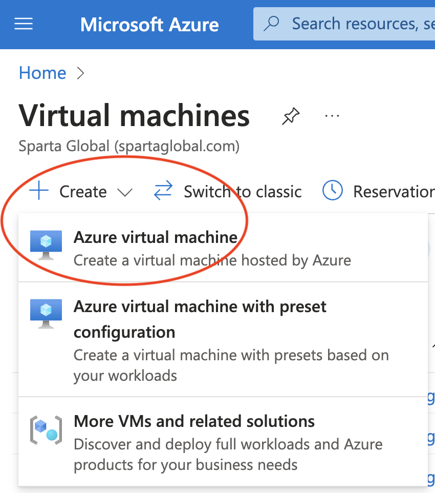

3. Enter the following details:
   
   - **Subscription**: *whatever is appropriate to your company or installation. In our case at Sparta Global it is "Azure Training.*
   - **Resource Group**: enter "cloudfun1"
   - **Virtual machine name**: give this a sensible name that follows a logical template guideline. In our case it will be "cloudfun1-<your_name>-uks-test-vm" (where uks stands for UK South; test signifies the purpose of the VM, e.g. test/dev/prod; vm indicates it's a vm and not a vnet or other piece of infrastructure)
   - **Region**: we are using "(Europe) UK South" as that is appropriate to our region

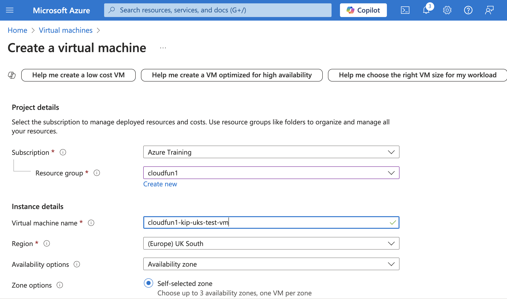

   - **Image**: choose either "Ubuntu Server 24.04 LTS - x64 Gen2" or "Ubuntu Server 22.04 LTS - x64 LTS - x64 Gen2"
   - **Size**: choose "Standard-B1s - 1vcpu, 1 GiB memory"

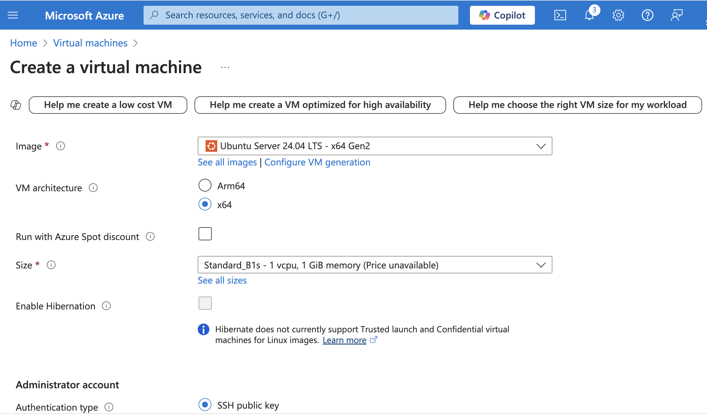

   - **Authentication type**: this should be "SSH public key"
   - **Username**: change this from "azureuser" to something more individual for security reasons, e.g. "adminuser". The reason being, everybody using Azure knows the default username is "azureuser"
   - **SSH public key source**: choose "Use existing key stored in Azure" from the dropdown menu. 
   - **Stored Keys**: select the key that you uploaded earlier

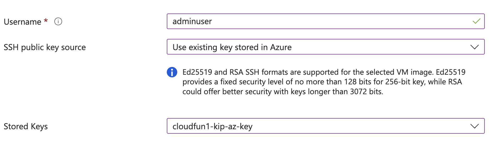

   - **Inbound port rules** > Select inbound ports: "SSH(22) will already be selected, but add "HTTP(80)". Network communication between computers over IP takes place by protocol, and different protocols use different ports. 

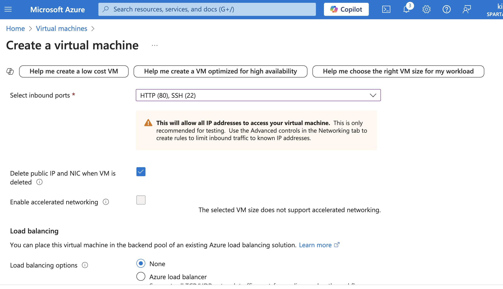

1. Click Next: Disks
2. - **OS disk size**: leave at "Image default (30 GiB)
   - **OS disk type**: choose "Standard SSD (locally-redundant storage)
   - Delete with VM: tick this box

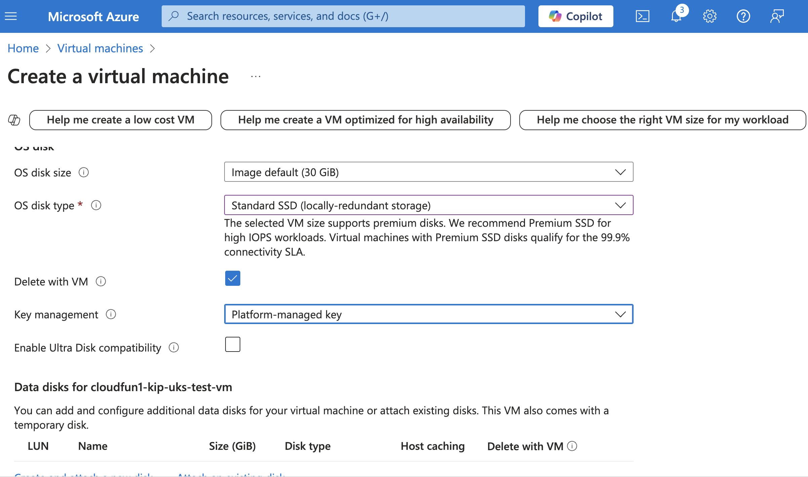
  
3. Click Next: Networking
4. - **Virtual network**: click "Create new" if you haven't got a virtual network already, otherwise choose the vnet you want
   - **Subnet**: this hsould default to "private-subnet IP" e.g. 10.0.3.0/24 or choose "Manage subnet configuration"
   - **Delete public IP and NIC when VM is deleted**: tick this box

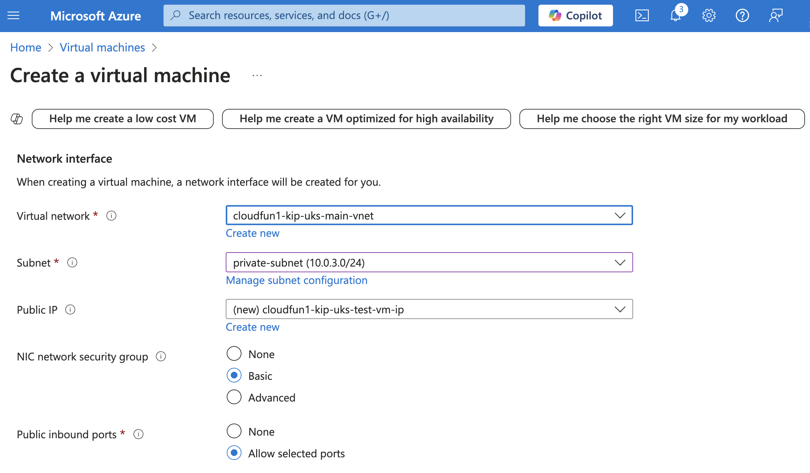

5. Click Next: Management
6.  CLick Next: Monitoring
7.  Click Next: Advanced
8.  Click Next: Tags
9.  - **Name**: enter "owner" as the value

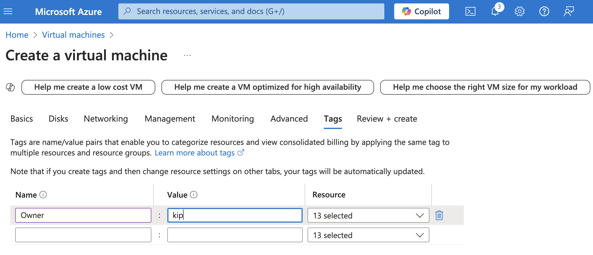

10. Click Review + create
11.  - **Preferred phone number**: enter your phone number here
12. Click Create
13. You should see a new page saying "Deployment in progress". This will update as the creation finishes. 
14. When this is finished, you should see "Your deployment is complete"

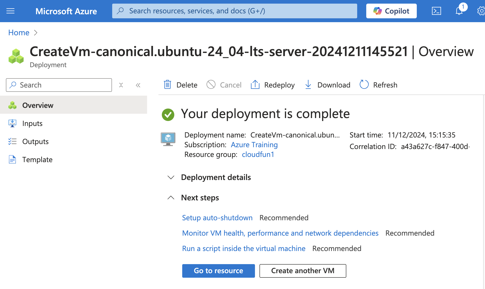

15. Click "Go to resource"

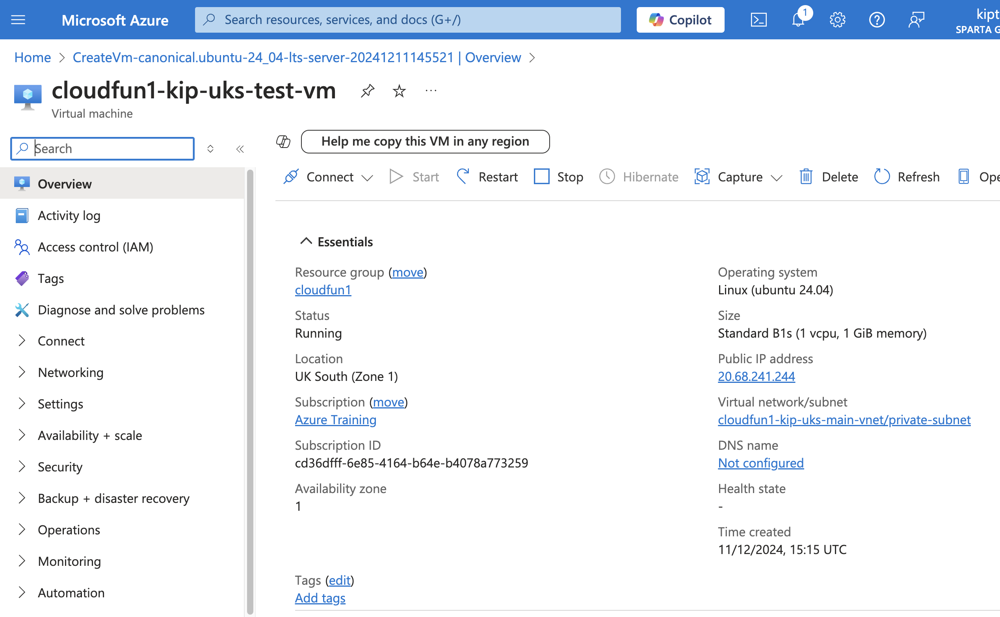

16. Make a note of the "Public IP address"


## TRY CONNECTING TO YOUR NEW VM OVER SSH

From your computer, open your terminal application (e.g. GitBash for Windows, Terminal for macOS users), and enter the following code:
```
$ ssh -i /path/to/private_key adminuser@<public_IP_address_of_VM>
```
and click Enter. NOTE: the -i argument followed by the parameter of the path/to/private_key, lets you specify the private key you want to connect using, if you have more than one RSA already.

You should now be able to connect to your VM over ssh. 

You may be prompted if you want to allow the connection and save it to your "known_hosts" file. You will need to say Yes to these. 

Your command prompt will now change to reflect your the Terminal of your new VM. 

To finish your session, type `exit` followed by Enter. 

